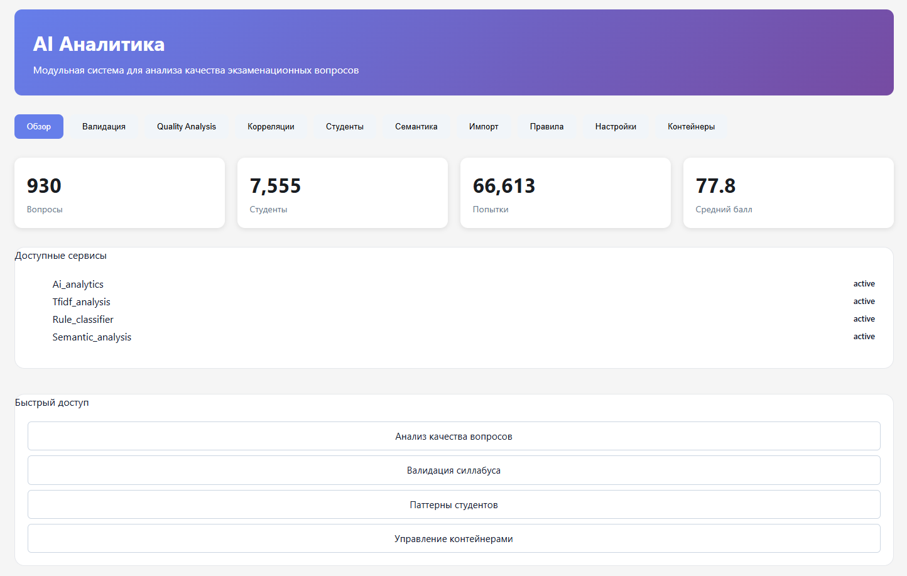
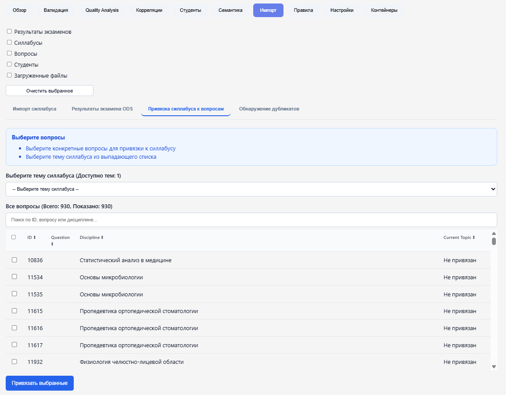
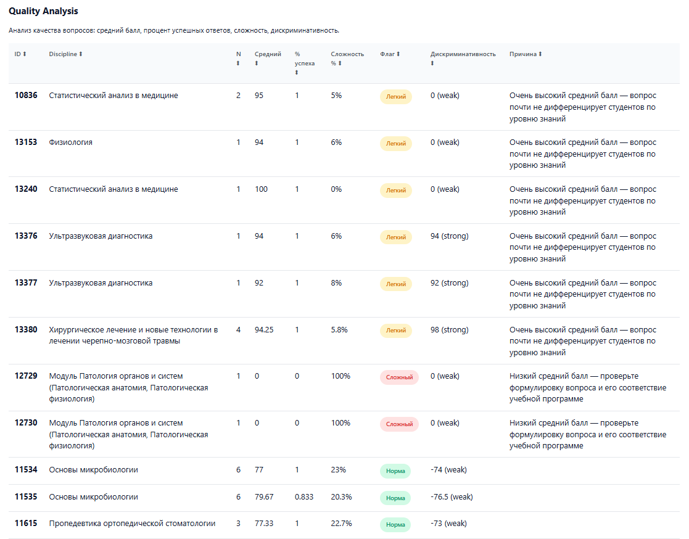

# AI Analytics - Exam Quality Analyzer

- **Валидация вопросов** - проверка соответствия силлабусу
- **Quality Analysis** - анализ сложности и дискриминативности вопросов
- **Correlation Analysis** - корреляция между вопросами и общими баллами
- **Student Patterns** - анализ успеваемости студентов
- **Semantic Analysis** - семантический поиск дубликатов
- **Импорт данных** - загрузка силлабусов и результатов экзаменов


- **PHP:** 8.0 +
- **MySQL/MariaDB:** 5.7 +
- **Web-сервер:** пример Apache (XAMPP)
- **Python:** 3.8+  
- **Расширения PHP:**
  - pdo_mysql
  - mbstring
  - json
  - zip
  - gd

### Настройки

1.  Открыть http://localhost/phpmyadmin
2. Создайте новую базу данных
3. Импортируйте SQL:  `ai_analytics.sql` , `exam_analyzer_2_full.sql`
4. При первом запуске будет создан пользователь по умолчанию:
   - Логин: `superadmin`
   - Пароль: `superadmin123`

 
1. **Установка Python зависимостей:** для эмбедингов, семантика + лучший импорт силлабусов
   ```bash
   cd \ai_standalone\python_services
   python embeddings_api.py
   ```
   





 

